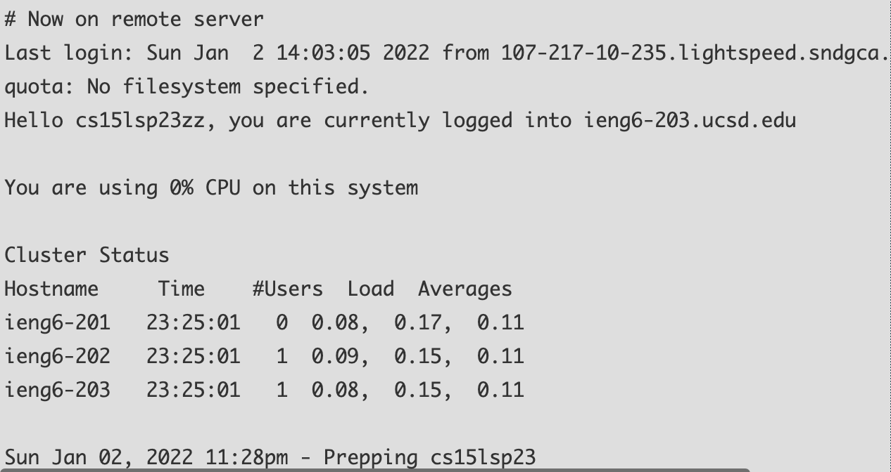

Installing VScode
  1. Go to https://code.visualstudio.com/
  2. Install it for your OS
  3. When open it, it should look like this
  
  
Remotely Connecting
  1. Find your CSE 15L account (if you don’t know it) with the Account Lookup at https://sdacs.ucsd.edu/~icc/index.php and reset your password if you need to
  2. Launch VScode and open a terminal (Ctrl or Command + `, or use the Terminal -> New Terminal menu option)
  3. After type in “ssh cs15lsp23zz@ieng6.ucsd.edu” and replace the zz with the letters in specific CSE 15L account
  4. After you connect you will get a message that says 
      ⤇ ssh cs15lsp23zz@ieng6.ucsd.edu
      The authenticity of host 'ieng6.ucsd.edu (128.54.70.227)' can't be established.
      RSA key fingerprint is SHA256:ksruYwhnYH+sySHnHAtLUHngrPEyZTDl/1x99wUQcec.
      Are you sure you want to continue connecting (yes/no/[fingerprint])? 
  **Make sure to type in yes**
  5. After you type in Yes, a new line that says “Password: “ will appear and you will input the 
     password for your CSE 15L (Note: when type in your password it won’t show any characters moving 
     for security reasons, so you can still type your password in and hit enter) If your password isn’t 
     working then you should try to reset your password and see if that fixes the issue.
  6. When you successfully input your password this should show up (below) and now your terminal is connected 
     to a computer in the CSE basement and any commands you run will run on that computer!
     
  
  Trying Some Commands!
  Since you’re connected you can now try out some commands
  Here are some specific useful commands to try:
    cd ~
    cd
    ls -lat
    ls -a
    ls <directory> where <directory> is /home/linux/ieng6/cs15lsp23/cs15lsp23abc, where the abc is one of the other group members’ username
    cp /home/linux/ieng6/cs15lsp23/public/hello.txt ~/
    cat /home/linux/ieng6/cs15lsp23/public/hello.txt
  
  Here is an example of some of the commands being ran
  
  
  
  
     
