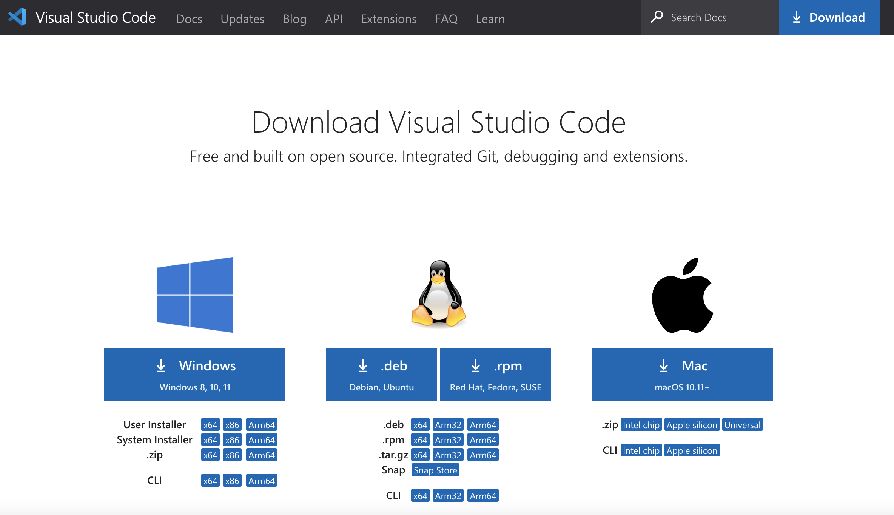
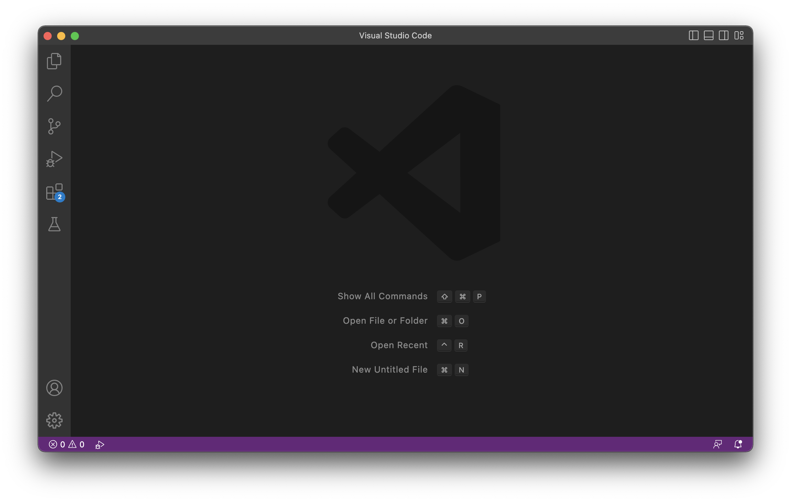
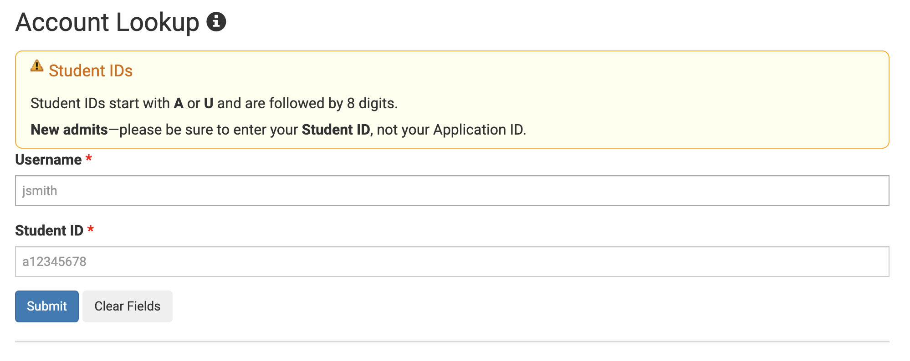
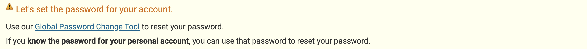
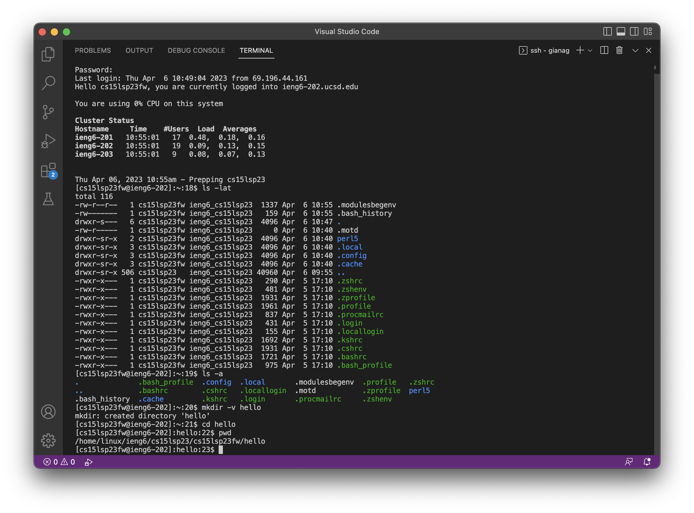

**Installing VScode**
  1. Go to [https://code.visualstudio.com/Download](https://code.visualstudio.com/Download)
  
  2. Install it for your OS
  3. When open it, it should look like this
  

**Remotely Connecting**
  1. Find your CSE 15L account (if you don’t know it) with the Account Lookup at [https://sdacs.ucsd.edu/~icc/index.php](https://sdacs.ucsd.edu/~icc/index.php) and you should enter in your UCSD username and PID to find your account 
   <br>
  
  2. Once you've gotten the username for your account to reset your password, just click on your CSE 15L account username and you should be able to reset your password with this  <br>
  3. Launch VScode and open a terminal   (
  <span style="color:blue"> **Ctrl or Command + `** </span>
  or use the Terminal -> New Terminal menu option ) <br>
  4. After type in “ssh cs15lsp23zz@ieng6.ucsd.edu” and replace the zz with the letters in specific CSE 15L account 
  It should look like this bellow <br>
      ```console
      $ ssh cs15lsp23zz@ieng6.ucsd.edu
      ```
<br>

  5. After you connect you will get a message that says 
      ```console
      ⤇ ssh cs15lsp23zz@ieng6.ucsd.edu
      The authenticity of host 'ieng6.ucsd.edu (128.54.70.227)' can't be established. 
      RSA key fingerprint is SHA256:ksruYwhnYH+sySHnHAtLUHngrPEyZTDl/1x99wUQcec.
      Are you sure you want to continue connecting (yes/no/[fingerprint])?
      ```
  Make sure to type in yes <br>
        <br>
        
        
      ```console
      # On your client
      ⤇ ssh cs15lsp23zz@ieng6.ucsd.edu
      The authenticity of host 'ieng6-202.ucsd.edu (128.54.70.227)' can't be established.
      RSA key fingerprint is SHA256:ksruYwhnYH+sySHnHAtLUHngrPEyZTDl/1x99wUQcec.
      Are you sure you want to continue connecting (yes/no/[fingerprint])? 
      Password:  
      ```
  5. After you type in Yes, a new line that says “Password: “ will appear and you will input the 
     password for your CSE 15L <br> (Note: when type in your password it won’t show any characters moving 
     for security reasons, so you can still type your password in and hit enter) If your password isn’t 
     working then you should try to reset your password and see if that fixes the issue. <br>
      
  6. When you successfully input your password this should show up (below) and now your terminal is connected 
     to a computer in the CSE basement and any commands you run will run on that computer!
     
     ```console
      # Now on remote server
      Last login: Sun Jan  2 14:03:05 2022 from 107-217-10-235.lightspeed.sndgca.sbcglobal.net
      quota: No filesystem specified.
      Hello cs15lsp23zz, you are currently logged into ieng6-203.ucsd.edu

      You are using 0% CPU on this system

      Cluster Status 
      Hostname     Time    #Users  Load  Averages  
      ieng6-201   23:25:01   0  0.08,  0.17,  0.11
      ieng6-202   23:25:01   1  0.09,  0.15,  0.11
      ieng6-203   23:25:01   1  0.08,  0.15,  0.11
      ```

Sun Jan 02, 2022 11:28pm - Prepping cs15lsp23

  
  Trying Some Commands! <br>
  Since you’re connected you can now try out some commands <br>
  Here are some specific useful commands to try: <br>
    cd ~ <br>
    cd <br>
    ls -lat <br>
    ls -a <br>
    ls <directory> where <directory> is /home/linux/ieng6/cs15lsp23/cs15lsp23abc, where the abc is one of the other group members’ username <br>
    cp /home/linux/ieng6/cs15lsp23/public/hello.txt ~/ <br>
    cat /home/linux/ieng6/cs15lsp23/public/hello.txt <br>
  
  Here is an example of some of the commands being ran
  
  
  
  
     
